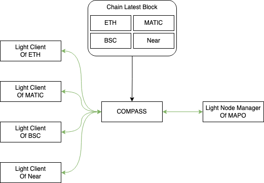
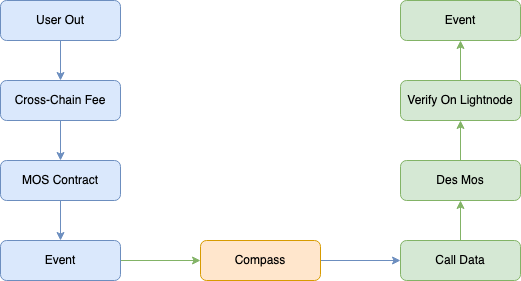

# Compass

## Compass - 架构及模块说明

### maintainer


### messenger


## Compass配置参数
compass 配置参数如下
```json
{
  "mapchain": {
    "id": "212",
    "endpoint": "http://18.142.54.137:7445",
    "from": "0xE0DC8D7f134d0A79019BEF9C2fd4b2013a64fCD6",
    "opts": {
      "mcs": "0x0ac4611305254cdd257beC56CB79CBeC720Cd02D",
      "lightnode": "0x000068656164657273746F726541646472657373",
      "http": "true",
      "gasLimit": "4000000000000",
      "maxGasPrice": "2000000000000",
      "syncIdList": "[34434]"
    }
  },
  "chains": [
    {
      "name": "pri-eth",
      "type": "ethereum",
      "id": "34434",
      "endpoint": "http://18.138.248.113:8545",
      "from": "0xE0DC8D7f134d0A79019BEF9C2fd4b2013a64fCD6",
      "opts": {
        "mcs": "0xcfc80beddb70f12af6da768fc30e396889dfce26",
        "lightnode": "0x80Be41aEBFdaDBD58a65aa549cB266dAFb6b8304",
        "http": "true",
        "gasLimit": "400000000000",
        "maxGasPrice": "200000000000",
        "syncToMap": "true"
      }
    }
  ],
  "other": {
    "monitor_url": "http:/slack...",
    "etcd": "...",
    "env": "example-compass-config"
  }
}
```
### main-config
```
{
      "name": "pri-eth",                                    // 链名称
      "type": "ethereum",                                   // 链类型，具体类型参考下表
      "id": "34434",                                        // 链ID
      "endpoint": "http://18.138.248.113:8545",             // 链rpc地址
      "from": "0xE0DC8D7f134d0A79019BEF9C2fd4b2013a64fCD6"  // 用户地址，使用此地址发送交易
}
```

|    chain     | type     |
|:------------:|----------|
| ethereum、map | ethereum |
|     bsc      | bsc      |
|  goerli、eth  | eth2     |
|   polygon    | matic    |
|     near     | near     |
|    klaytn    | klaytn   |
|    platon    | platon   |
|   conflux    | conflux  |

### Opts
```
{
    "mcs": "0x12345...",                                    // mcs地址
    "maxGasPrice": "0x1234",                                // 最高gasPrice
    "gasLimit": "0x1234",                                   // 最高gasLimit
    "gasMultiplier": "1.25",                                // gasPrice倍数
    "http": "true",                                         // 链接chain是否使用http
    "startBlock": "1234",                                   // 程序开始的block高度
    "blockConfirmations": "10"                              // block与链上最新的block高度相差多少
    "egsApiKey": "xxx..."                                   // apiKey,详细请查看 (https://www.ethgasstation.info/)
    "egsSpeed": "fast"                                      // gasPrice速度，例如 "average", "fast", "fastest"
    "lightnode": "0x12345...",                              // lightnode地址
    "syncToMap": "true",                                    // block是否同步到map
    "syncIdList": "[214]"                                   // map header同步到那些chain，使用chainId
    "event": "mapTransferOut(...)|depositOutToken(...)",    // mcs扫描事件                                              
}
```
### Other
```
{
    "monitor_url": "http:/slack...", // 程序监控告警地址，目前支持slack
    "etcd": "...",                   // 注册中心地址，程序运行，会向此地址注册
    "env": "example-compass-config"  // 告警前缀、程序运行标识
  }
```

## Compass环境与部署
### 环境
需要安装 Go 1.16+，gcc、make，需要near链的，请安装npm，登陆生成你的账户凭证，机器2C4G以上。
### 常规部署
1. clone项目 https://github.com/mapprotocol/compass 到机器中
2. cd compass && make build
3. 通过以下命令，导入你账户的私钥，compass accounts import --privateKey key
4. 运行 maintainer compass maintainer --blockstore ./blockStore --config ./config.json （其中blockStore为本次存储历史进度，下次运行时，会从本地读取历史进度并从此进度开始）
5. 运行 messenger compass messenger --blockstore ./blockStore --config ./config.json
### Docker 部署
1. 通过项目下的Dockerfile文件编译，docker build -t compass:1.0.0 .
2. 编译之后查看编译的镜像，docker images
3. 运行镜像 docker run --name maintainer -d -e KEYSTORE_PASSWORD=$KEYSTORE_PASSWORD -v ${你的配置文件目录}:/root/config -v ${你的账户文件目录}:/root/keys -v ${你的Near账户文件目录}:/root/.near-credentials compass:1.0.0 maintainer --config /root/config/config.json --blockstore /root/config/all/maintainer （建议blockStore目录与配置目录放在一起）

## Compass二次开发 - 基于compass定义自己的路由服务
目前compass仅将生成proof部分摘除，更多后续请关注官方社区

具体请查看 https://github.com/mapprotocol/compass-sdk