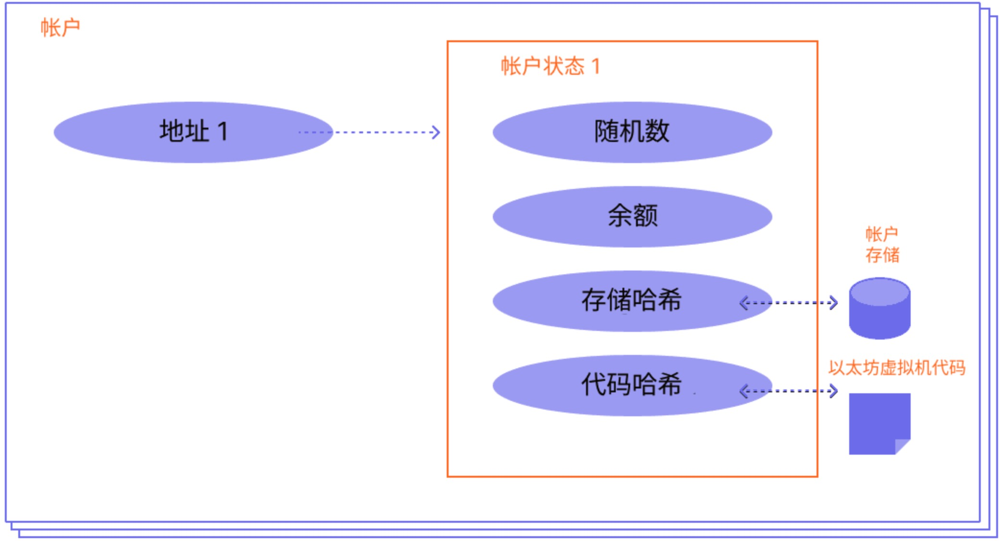

一个MAPO帐户是一个具有[MAPO-Relay-Chain](/docs/base/mapo-relay-chain/index.md)主网币(MAPO) 余额的实体，可以在[MAPO-Relay-Chain](/docs/base/mapo-relay-chain/index.md)上发送交易。 帐户可以由用户控制，也可以作为智能合约部署。以下说的`MAPO`都是指的是`MAPO-Relay-Chain`.

## 前提条件 {#prerequisites}

帐户是一个很适合初学者的主题。 但为了帮助您更好地理解这个页面，我们建议您首先阅读我们的[MAPO简介](/docs/base/intro-to-mapo/index.md)。

## 帐户类型 {#types-of-account}

MAPO有两种帐户类型：

- 外部所有的帐户 (EOA) – 由任何拥有私钥的人控制
- 合约帐户 — 部署到网络上的智能合约，由代码控制。 了解[智能合约](/docs/mapo-stack/compatible-evm/index.md)。

这两种帐户类型都能：

- 接收、持有和发送 MAPO币 和 token
- 与已部署的智能合约进行交互

### 主要区别 {#key-differences}

**外部持有**

- 创建帐户是免费的
- 可以发起交易
- 外部所有的帐户之间只能进行MAPO币和代币交易
- 由一对加密密钥组成：控制帐户活动的公钥和私钥

**合约**

- 创建合约存在成本，因为需要使用网络存储空间
- 只能在收到交易时发送交易
- 从外部帐户向合约帐户发起的交易能触发可执行多种操作的代码，例如转移代币甚至创建新合约
- 合约帐户没有私钥。 相反，它们由智能合约代码逻辑控制

## 理解帐户 {#an-account-examined}

MAPO帐户有四个字段：

- `nonce` - 一个计数器，用来显示外部帐户发送的交易数量或合约帐户创建的合约数量。 每个帐户只能执行具有一个给定该数的一笔交易，以防范重放攻击，重放攻击指多次广播和重复执行已签署的交易。
- `balance` – 这个地址拥有的 Wei 数量。 Wei 是MAPO币的计数单位，每个 MAPO币 有 1e+18 Wei。
- `codeHash` - 该哈希表示虚拟机 (EVM) 上的帐户*代码*。 合约帐户具有编程的代码片段，可以执行不同的操作。 如果帐户收到消息调用，则执行此 EVM 代码。 与其他帐户字段不同，不能更改。 所有代码片段都被保存在状态数据库的相应哈希下，供后续检索。 此哈希值称为 codeHash。 对于外部所有的帐户，codeHash 字段是空字符串的哈希。
- `storageRoot` – 有时被称为存储哈希。 Merkle Patricia trie 根节点的 256 位哈希已编码了帐户的存储内容（256 位整数值映射），并编码为 Trie，作为来自 256 的 Keccak 256 位哈希的映射位整数键，用于 RLP 编码的 256 位整数值。 此 Trie 对此帐户存储内容的哈希进行编码，默认情况下为空。

 

## 外部持有的帐户和密钥对 {#externally-owned-accounts-and-key-pairs}

帐户由公钥和私钥加密对组成。 它们有助于证明交易实际上是由发送者签名的，并防止伪造。 您的私钥是您用来签名交易的密钥，所以它保障您对与您帐户相关的资金进行管理。 您从未真正持有加密货币，您持有私钥 – 资金总是在`map-relay-chain`的账本上。

这将防止恶意参与者广播虚假交易，因为您总是可以验证交易的发送者。

如果 Alice 想要从她自己的帐户发送 MAPO币 到 Bob 的帐户，Alice 需要创建交易请求并将其发送到网络进行验证。 `map-relay-chain`对公钥加密的使用确保了 Alice 可以证明她最初发起了交易请求。 没有加密机制，恶意对手 Eve 可以简单地公开广播一个看起来像“从 Alice 的帐户发送 5 MAPO币 到 Eve 帐户”的请求。而且没有人能够证实它不是来自 Alice 的。

## 帐户 {#account}

当你想要创建一个帐户时，大多数库将生成一个随机的私钥。

私钥由 64 个十六进制字符组成，可以用密码加密保存。

例如：

`2851c4480f425bc4bd65bc673fc08683efe844d83bb5ae9a04e9566af5bbe2a1`

使用[椭圆曲线数字签名算法](https://wikipedia.org/wiki/Elliptic_Curve_Digital_Signature_Algorithm)从私钥生成公钥。 通过获取公钥 Keccak-256 哈希的最后 20 个字节并校验码前面添加 `0x`，可以为帐户获取公共地址。

可以通过您的私钥获取公钥，但您不能通过公钥获取私钥。 这意味着保持私人密钥的安全至关重要，如同名称所建议的 **PRIVATE**。

您需要一个私钥来签署消息和交易并输出签名。 然后其他人可以使用签名获取您的公钥，证明信息的作者。 在您的应用程序中，您可以使用 javascript 库向网络发送交易。

## 合约帐户 {#contract-accounts}

合约帐户也有一个 42 个字符组成的十六进制地址：

例如：

`0x3CC4f7fB1C8edD8E37A6dD56456911fae41538cc`

合约地址通常在将合约部署到`map-relay-chain`区块链时给出。 地址产生自创建人的地址和从创建人地址发送的交易数量（“nonce”）。

## 验证者密钥 {#validators-keys}

MAPO还有一另种类型的密钥，它们是“BLS”密钥，用来识别验证者，在共识过程中用于就新区块的状态达成一致。 这些密钥可以有效地聚合，减少网络达成共识所需要的带宽。 没有这种密钥集合，验证者的最小质押金额将会高出许多。

[更多关于验证者密钥的信息](/docs/base/mapo-relay-chain/pos.md)。

## 关于钱包的说明 {#a-note-on-wallets}

帐户和钱包不同。 帐户是用户拥有的MAPO帐户的密钥对。 钱包是界面或应用程序，可以让你与MAPO帐户交互。

## 延伸阅读 {#further-reading}

_还有哪些社区资源对你有所帮助？ 请编辑本页面并添加！_

## 相关主题 {#related-topics}

- [智能合约](/docs/mapo-stack/compatible-evm/index.md)
- [交易](/docs/base/transactions/index.md)
