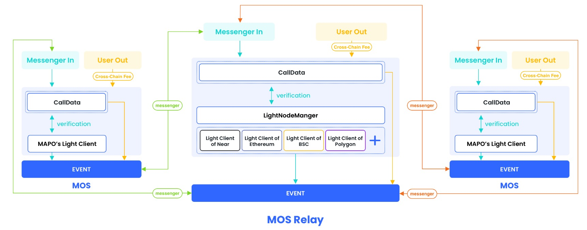

消息跨链（Message Cross-Chain），也被称为跨链通信或跨链交互，是指在不同的区块链网络之间传输和交换信息或数据的过程。跨链技术的目标是实现不同区块链之间的互操作性，使它们能够协同工作和交换价值，而无需中介。

以下是消息跨链的一些关键概念和要点：

+ 不同区块链网络: 消息跨链通常涉及到不同的区块链网络，每个网络可能有自己的区块链协议、共识机制和智能合约平台。

+ 信息传输: 消息跨链可以包括在不同区块链之间传输和共享信息、交易、智能合约或其他数据。这些信息可以包括资产所有权、交易历史、智能合约状态等。

+ 互操作性: 关键目标是实现互操作性，以便不同区块链能够理解和处理彼此的数据和交易。这可能需要制定共同的标准或协议来确保信息的一致性和可靠性。

+ 跨链桥: 跨链桥是连接不同区块链网络的技术组件，它允许在不同链上锁定资产，并在需要时释放它们。这是实现跨链通信的关键工具之一，MAPO使用轻客户端技术构建的跨链基础设施可以实现无信任，去中心化的验证跨链双方状态。

+ 资产转移: 一种常见的跨链应用是将资产从一个区块链转移到另一个区块链。这可以用于实现跨链支付、跨链交换和其他跨链交易。

+ 安全性和信任: 跨链通信需要考虑安全性和信任问题，因为不同区块链网络可能具有不同的安全特性和共识机制。确保跨链交互的安全性至关重要。

消息跨链技术正在成为区块链领域的重要发展方向，因为它可以打破各个独立区块链之间的壁垒，使它们能够更好地协同工作，扩展应用场景，提供更多的金融和非金融服务，以及增强整个区块链生态系统的互通性。跨链通信的成功实现有望推动区块链技术的广泛采用。

## MAPO实现消息跨链

MAP Protocol 通过使用轻量级客户端 (Light-client) 实现跨链消息的传递。我们以A,B链间的消息跨链`[A <--> B]`为例，以下是具体的步骤：

 
+ 消息创建: 当一条跨链消息在源链(A链)上产生时，它会被打包进该链的区块中，并被广播至整个网络,MAPO的[mos层](/docs/base/mos/index.md)提供了标准的消息跨链接口[transferOut](https://github.com/mapprotocol/mapo-service-contracts/blob/main/evm/contracts/interface/IMOSV3.sol#L45),该接口支持用户自定义需要跨链的消息，一条该接口的合约[交易](/docs/base/transactions/index.md)将会通过MAPO Protocol协议完整的搬移到目的链(B链)上，并可以在目标链(B链)上通过上层应用执行。

+ 消息跨链交易提交: 当跨链消息的交易在源链(A链)上被打包后,MAPO Protocol的[Compass服务(Messenger)](/docs/base/Compass/index.md)将会监控到该条交易并将该交易和其合法性的证明数据提交到目标链(B链)的[mos层](/docs/base/mos/index.md),目标链(B链)[mos层](/docs/base/mos/index.md)将会通过部署在本链(B链)上的源链(A链)的[轻客户端](/docs/base/light-client/index.md)来验证该跨链交易的合法性。

+ 区块头同步: 轻量级客户端需要保持对源链的区块头信息的同步，可以验证消息是否已经被包含在区块中。MAPO Protocol协议的[Compass服务(Maintainer)](/docs/base/Compass/index.md)将会自动的同步源链(A链)和目的链(B链)上的区块头到对端的[轻客户端](/docs/base/light-client/index.md),以维持双方轻客户端上保持最新的状态。

+ 跨链消息验证: [轻客户端](/docs/base/light-client/index.md)可以通过检查源链的区块头信息来验证跨链消息。它会查看区块中是否包含了要验证的消息的哈希值。

+ 消息转发与执行: 一旦消息被验证和确认在源链上，那么就可以在目标链上执行这条消息。

整体来说，利用轻量级客户端，MAP Protocol 可以在源链和目标链之间实现安全、高效的跨链消息传递与验证，保证了链与链之间数据传递的准确性，实现了真正的跨链互操作性。