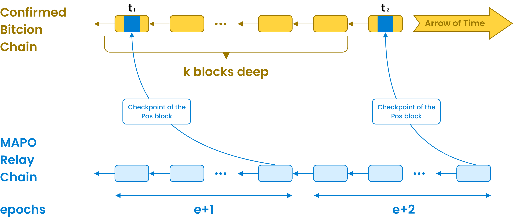

## BTC layer2

Similar to Layer 2 solutions within the Ethereum ecosystem, Bitcoin Layer 2 also focuses on bringing more use cases to the ecosystem and reducing transaction fees. Common Bitcoin Layer 2 solutions such as off-chain networks, centralized sidechains, and federated sidechains provide improved scalability and privacy protection for the Bitcoin network, although they are still somewhat behind compared to the Ethereum ecosystem. In May 2023, an innovative experiment called BRC-20 was implemented based on the [Ordinals protocol](https://docs.ordinals.com/), aimed at testing whether the Ordinals protocol could enhance the fungibility of Bitcoin, similar to the effect of issuing ERC-20 tokens on the Ethereum network. This experiment showcased the potential for Bitcoin interoperability.

As a peer-to-peer, cross-chain interoperability infrastructure, MAP Protocol has always been focused on cross-chain interoperability. Now, MAP Protocol is also serving as a Bitcoin Layer 2. On one hand, it leverages the Bitcoin network to enhance the security of its MAP Protocol network. On the other hand, it uses its cross-chain technology to further enrich the Bitcoin ecosystem, providing a new trading experience for the BRC-20 community.

### Ensuring the security of MAP Protocol through the Bitcoin network further

Bitcoin, with its immense computational power, can be considered a natural source of trust and serves as a `timestamp server` supported by proof of work. It provides an irreversible time order for events. In its native application, events involve various transactions executed on the Bitcoin ledger. In current applications aimed at enhancing the security of other blockchains, Bitcoin can also be used to timestamp events occurring in other blockchains. Each such event triggers a transaction sent to miners, who subsequently insert it into the Bitcoin ledger, thus timestamping the event. Transactions that timestamp events are referred to as `checkpoints`.

`Checkpoints` can be implemented using the `OP_RETURN` opcode of Bitcoin, which allows the publication of arbitrary 80-byte data in unspendable Bitcoin transactions. Each checkpoint must contain at least the hash of the PoS block to be checked (32 bytes) and a signature finalizing that block (32 bytes each). Here, the hash is used to identify the PoS block being checkpointed, and the signature is required to prevent adversaries from sending arbitrary hashes and pretending to checkpoint PoS blocks on Bitcoin.

A PoS chain can enhance its security and address the [long-range attack](https://medium.com/@abhisharm/understanding-proof-of-stake-through-its-flaws-part-3-long-range-attacks-672a3d413501) problem by utilizing the Bitcoin timestamp service's features. The `MAPO` platform regularly (every epoch) submits the `hash` and `signature` of the last block of each epoch as a `checkpoint` to the Bitcoin network. These `checkpoints` consist of the hash of the block and a single aggregated `BLS signature`, corresponding to the signature of the 2/3 set of validators who signed the block for finality, as well as the `epoch number` and `bitmap number`. As a result, `MAPO` clients can determine the final canonical chain of the `MAPO` platform's PoS chain by retrieving checkpoints from the Bitcoin network, thus protecting against [long-range attacks](https://medium.com/@abhisharm/understanding-proof-of-stake-through-its-flaws-part-3-long-range-attacks-672a3d413501) by malicious validators on the MAPO network.

 

### Enriching the Bitcoin ecosystem and enhancing the liquidity of BRC-20 assets.

The `MAPO` platform supports the cross-chain transfer of [inscription](https://docs.ordinals.com/inscriptions.html) assets (BRC-20) from the Bitcoin network to the `MAPO` platform in a peer-to-peer manner. This enables other cryptocurrencies on different blockchains to be traded with `BRC-20` assets through a more convenient and cost-effective route, enhancing the liquidity of [inscription](https://docs.ordinals.com/inscriptions.html)  assets. This interoperability helps expand the use cases of Bitcoin and integrates the Bitcoin ecosystem into a broader crypto financial ecosystem, bringing new contributions to the Bitcoin community.

`MAPO` provides a comprehensive solution that allows users to easily transfer `BRC-20` assets to the `MAPO` platform. `MAPO` utilizes the native [mapo-brc201](/docs/btc-layer2/brc201.md) protocol on the Bitcoin network, enabling users to seamlessly move assets from the `BRC-20` protocol to the BRC201 protocol and cross-chain to the `MAPO` platform without any loss. As shown in the diagram: 

 

+ Indexer Service: The Indexer service is primarily responsible for gathering and parsing `inscription transactions` on the Bitcoin network. It collects information related to these transactions, making them accessible for further analysis and processing.

+ Collection Service: Building on the data obtained from the Indexer service, the Collection service is responsible for analyzing and processing data related to `BRC-20` and [BRC-201](/docs/btc-layer2/brc201.md) protocols. It focuses on identifying and saving relevant user assets associated with these protocols.

+ Bridge Service: The Bridge service plays a crucial role in routing `BRC-20` assets from the Bitcoin network to the MAPO platform using the [BRC-201](/docs/btc-layer2/brc201.md) protocol. This service facilitates the seamless transfer of assets between the two networks, enhancing interoperability.

+ Order Service: The Order service is designed to support the creation and management of `inscription transactions` based on the [BRC-201](/docs/btc-layer2/brc201.md) protocol. It helps users construct and execute transactions that adhere to this protocol.

These services collectively contribute to the smooth operation and functionality of the MAPO platform, allowing for the transfer and management of assets across the Bitcoin network and the MAPO ecosystem.