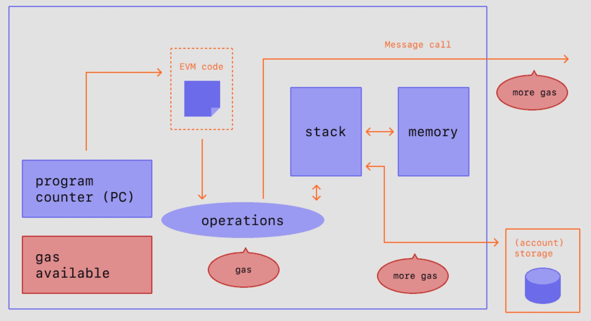

`MAPO-Relay-Chain`使用以太坊EVM作为链的虚拟机，该虚拟机是所有`MAPO-Relay-Chain`帐户和智能合约依存的环境。 在链上任何给定的区块处，`MAPO-Relay-Chain`有且只有一个“规范”状态，而EVM虚拟机定义从一个区块到另一个区块计算新的有效状态的规则。以下`MAPO-Relay-Chain`统称为MAPO.

## 前提条件 {#prerequisites}

对计算机科学中常见术语的基本了解，如[字节](https://wikipedia.org/wiki/Byte)、[内存](https://wikipedia.org/wiki/Computer_memory)和[堆栈](<https://wikipedia.org/wiki/Stack_(abstract_data_type)>)是理解 EVM 的前提。 熟悉[哈希函数](https://wikipedia.org/wiki/Cryptographic_hash_function)和[默克尔树](https://wikipedia.org/wiki/Merkle_tree)等密码学/区块链概念也会很有帮助。


## 状态转换函数 {#the-state-transition-function}

EVM 的行为就像一个数学函数：在给定输入的情况下，它会产生确定性的输出。 因此，MAPO网络可以描述为具有**状态转换函数**非常有帮助：

```
Y(S, T)= S'
```

给定一个旧的有效状态 `（S）`> 和一组新的有效交易 `（T）`，状态转换函数 ` Y（S，T）` 产生新的有效输出状态` S'`

### 状态 {#state}

在MAPO环境中，状态是一种称为[改进版默克尔帕特里夏树](/docs/base/mpt/index.md)的巨大数据结构，它保存所有通过哈希关联在一起的[帐户](/docs/base/accounts/index.md)并可回溯到存储在区块链上的单个根哈希。

### 交易 {#transactions}

交易是来自帐户的密码学签名指令。 交易分为两种：一种是消息调用交易，另一种是合约创建交易。

合约创建交易会创建一个新的合约帐户，其中包含已编译的 [智能合约](/docs/mapo-stack/compatible-evm/index.md#智能合约smart-contracts) 字节码。 每当另一个帐户对该合约进行消息调用时，它都会执行其字节码。

## EVM 说明 {#evm-instructions}

EVM 作为一个[堆栈机](https://wikipedia.org/wiki/Stack_machine)运行，其栈的深度为 1024 个项。 每个项目都是 256 位字，为了便于使用，选择了 256 位加密技术（如 Keccak-256 哈希或 secp256k1 签名）。

在执行期间，EVM 会维护一个瞬态*内存*（作为字可寻址的字节数组），该内存不会在交易之间持久存在。

然而，合约确实包含一个 Merkle Patricia _存储_ trie（作为可字寻址的字数组），该 trie 与帐户和部分全局状态关联。

已编译的智能合约字节码作为许多 EVM opcodes执行，它们执行标准的堆栈操作，例如 `XOR`、`AND`、`ADD`、`SUB`等。 EVM 还实现了一些区块链特定的堆栈操作，如 `ADDRESS`、`BALANCE`、`BLOCKHASH` 等。




## 智能合约{#smart-contracts}

智能合约是MAPO应用程序的基石。 它们是存储在区块链上的计算机程序，让我们能够将传统合约转换成数字化合约。 智能合约完全符合逻辑 — 遵循 IFTTT （if this then that）逻辑结构。 这意味着它们完全按照程序设定执行并且不能更改。

确保在您已深入了解[帐户](/docs/base/accounts/index.md)、[交易](/docs/base/transactions/index.md)和上面的`EVM虚拟机`，然后再开始学习智能合约。

### 什么是智能合约？ {#what-is-a-smart-contract}

智能合约只是一个运行在MAPO链上的一个程序。 它是位于MAPO区块链上一个特定地址的一系列代码（函数）和数据（状态）。

智能合约也是一个[MAPO帐户](/docs/base/accounts/index.md)，我们称之为合约帐户。 这意味着它们有余额，可以成为交易的对象。 但是，他们无法被人操控，他们是被部署在网络上作为程序运行着。 个人用户可以通过提交交易执行智能合约的某一个函数来与智能合约进行交互。 智能合约能像常规合约一样定义规则，并通过代码自动强制执行。 默认情况下，您无法删除智能合约，与它们的交互是不可逆的。

### 自动执行 {#automation}

与普通合约相比，智能合约最显著的优势之一是，当合约条件满足时，结果会自动执行。 无需等待人来执行结果。 换句话说：智能合约无需信任。

例如，您可以编写一个智能合约为孩子托管资金，并允许他们在特定日期后提取资金。 如果孩子试图在指定日期前提取资金，智能合约将不会执行。 或者您可以编写一份合约，在您向经销商付款后它会自动授予您汽车的数字化所有权。

### 可预测的结果 {#predictability}

人为因素是传统合同最大的缺陷之一。 例如，两位不同的法官可能会用不同方式解释传统合约。 他们的解释可能导致不同的判决和不同的结果。 智能合约消除了产生不同解释的可能性。 相反，智能合约会根据合约代码中写入的条件精确执行。 这种精确性意味着在相同情况下，智能合约将产生相同的结果。

### 公开的记录 {#public-record}

智能合约也可用于审计和跟踪。 由于MAPO智能合约位于公共区块链上，任何人都可以立即跟踪资产转移和其他相关信息。 例如，您可以查看是否有人向您的地址汇款。

### 隐私保护 {#privacy-protection}

智能合约还可以保护你的隐私。 由于MAPO是匿名网络（您的交易公开绑定到唯一的加密地址，而不是您的身份），您可以保护您的隐私不受观察者窥探。

### 可查看的条款 {#visible-terms}

最后一点，与合约一样，您可以在签署（或以其他方式与之交互）之前检查智能合同的内容。 更妙的是，合约条款的公开透明意味着任何人都可以对其进行审查。


### 无需准入性 {#permissionless}

任何人都可以编写智能合约并将其部署到区块链网络上。 您只需要学习如何用[智能合约语言编码](/docs/mapo-stack/compatible-evm/solidity.md)，并有足够的MAPO币来部署您的合约。 部署智能合约在技术上是一笔交易，因此就像你需要为简单的MAPO币转账支付燃料费一样，你也需要为部署智能合约支付[燃料费](/docs/base/gas/index.md)。 但是，合约部署的燃料成本要高得多。

MAPO提供了对开发者友好的智能合约编程语言：

- Solidity

然而，智能合约必须要先编译才能部署，以便EVM虚拟机可以解释并存储它们。 [关于编译的更多信息](/docs/mapo-stack/compatible-evm/compile.md)

### 可组合性 {#composability}

智能合约在MAPO上公开，并且可以看成开放应用程序接口。 这意味着你可以在自己的智能合约中调用其他智能合约，以大幅扩展可能的功能。 合约甚至可以部署其他合约。

了解关于[智能合约可组合性](/docs/mapo-stack/compatible-evm/composability.md)的更多信息。

### 局限性 {#limitations}

智能合约本身无法获取关于“真实世界”事件的信息，因为它们无法发送 HTTP 请求。 这是设计使然。 因为依赖外部信息可能会影响共识，而共识对安全性和去中心化而言十分重要。

这可以通过`预言机`来规避。


### 智能合约资源 {#smart-contract-resources}

**OpenZeppelin 合约\*\*** - _安全智能合约开发库。_\*\*

- [openzeppelin.com/contracts/](https://openzeppelin.com/contracts/)
- [GitHub](https://github.com/OpenZeppelin/openzeppelin-contracts)
- [社区论坛](https://forum.openzeppelin.com/c/general/16)


## 相关主题 {#related-topics}

- [Gas](/docs/base/gas/index.md)
